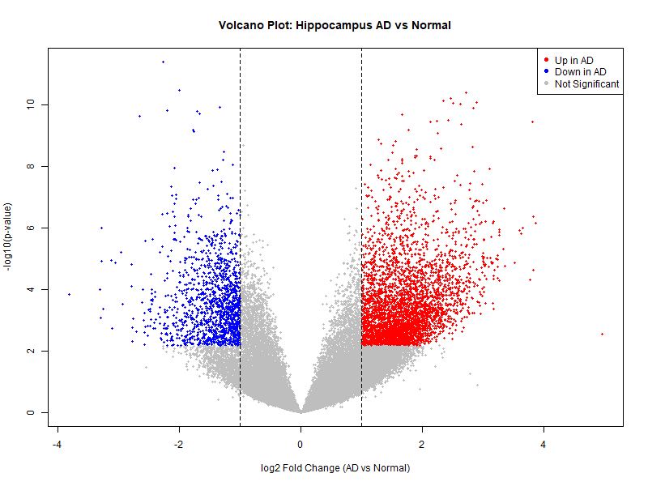

# Alzheimer Hippocampus Gene Expression
Self learning project analyzing gene expression differences between Alzheimer's and healthy hippocampus samples (GSE5281)

## A Note on This Project

I am a first year Statistics student at Hacettepe University. I did this project because I am interested in biostatistics, and I used an AI assistant (Claude) to help me while working on it.
*Full R code available in [`analysis.R`](analysis.R)*

## What This Project Does

This project looks at gene expression data from brain tissue and tries to answer a simple question: can we tell Alzheimer's Disease (AD) patients
apart from healthy people just by looking at which genes are more or less active? I used three basic methods to explore this: PCA (a way to simplify
a lot of data into a picture), a statistical test to find genes that differ between the two groups, and two simple machine learning models to try to
predict AD from gene activity.

## Data

I used the GSE5281 dataset from NCBI GEO (Gene Expression Omnibus), a public database for gene expression data.
The full dataset has 161 brain tissue samples (87 AD, 74 healthy) from six different brain regions. Since AD and healthy samples were not evenly 
spread across regions, using all of them together would risk mixing up brain region differences with disease differences. To avoid this, I
narrowed the analysis down to a single region: the hippocampus, which is one of the areas most affected by Alzheimer's Disease. This left 23
samples (10 AD, 13 healthy) a much smaller dataset, but a cleaner one.Each sample has expression values for 54,675 probes (a probe roughly corresponds to a gene, though a few genes are covered by more than one probe). This means the dataset has far more variables (54,675) than samples (23) — a common situation in gene expression data, and one that needs to be kept in mind when interpreting any result below.

## Preprocessing

I checked the data for missing values (there were none) and looked at the distribution of expression values. The raw values were highly skewed 
(median around 49, maximum around 144,000), so I applied a log2 transformation, which is standard practice for this type of data.
While exploring the data, I noticed that some of the top genes in my early results were labeled 'AFFX-....' These are not real human genes they are synthetic control probes added for quality control purposes.Their presence at the top of my results suggested a technical difference between samples rather than a biological one, so I removed all control probes before continuing.

## PCA Results

To see if AD and healthy samples look different from each other overall, I used PCA (Principal Component Analysis). PCA takes all 54,613 genes for
each sample and reduces them into just a few numbers, so we can plot each sample as a single point and see if patterns show up.

The first two components (PC1 and PC2) explain 18.5% and 8.1% of the variation in the data (26.6% together). This might sound low, but it is
normal for gene expression data, since there are far more genes (54,613) than samples (23).Looking at the plot, healthy samples (blue) are mostly on the left side and AD samples (red) are mostly on the right side, along PC1. The separation is not perfect a few points fall in the wrong area but the pattern is clear enough to suggest that gene expression differences between the two groups are real, not just random noise.

## Differential Expression Analysis (Volcano Plot)

After looking at the overall pattern with PCA, I wanted to find which specific genes are different between AD and healthy samples. For each of
the 54,613 genes, I ran a t-test comparing the AD group to the healthy group. Since testing this many genes at once increases the chance of
finding significant results just by chance, I applied an FDR (False Discovery Rate) correction to the p-values, which is the standard way to
handle this problem.

A volcano plot shows both how big the difference is x-axis and how statistically significant it is y-axis for every gene at once. I marked
a gene as meaningfully different only if it passed two conditions: at least a 2-fold change in expression, and an FDR-adjusted p-value below
0.05. Using these two conditions together (not just the p-value alone) helps filter out differences that are statistically significant but too
small to matter biologically.With these criteria, 3,829 genes were higher in AD (red, right side) and 1,339 genes were lower in AD (blue, left side), out of 54,613 genes tested. This is still a large number, but it is a much more focused list than looking at raw p-values alone. 

## Top Genes

Here are the 10 genes with the strongest statistical signal (lowest
adjusted p-value):

| Gene Symbol | Gene Name | log2 Fold Change | Adjusted p-value |
|---|---|---|---|
| HAPSTR1 | HUWE1 associated protein modifying stress responses | -2.27 | 2.15e-07 |
| ERC1 | ELKS/RAB6-interacting/CAST family member 1 | 2.46 | 6.31e-07 |
| ACTB | actin beta | -2.01 | 6.31e-07 |
| KTN1 | kinectin 1 | 2.35 | 6.31e-07 |
| YLPM1 | YLP motif containing 1 | 2.51 | 6.31e-07 |
| TBL1XR1 | TBL1X/Y related 1 | 2.62 | 6.31e-07 |
| ELAVL3 | ELAV like RNA binding protein 3 | 2.89 | 6.31e-07 |
| (unnamed probe) | not found in annotation database | 2.72 | 6.31e-07 |
| SUPT16H | SPT16 homolog, facilitates chromatin remodeling subunit | -1.33 | 7.05e-07 |
| GPR155 | G protein-coupled receptor 155 | 2.84 | 7.05e-07 |

I don't have the biology background to interpret what each of these genes does. One thing worth noting: ACTB is usually a stable reference gene
in experiments, so its appearance here might point to a technical ifference between samples rather than a real biological one similar to the AFFX control probe issue I found earlier.

## Classification Models

The last step was to see if a model could predict AD vs. healthy just from gene expression values. Since there are only 23 samples, splitting
the data into a separate training and test set would leave too few samples to test on. Instead, I used Leave One Out Cross Validation (LOOCV): the model is trained 23 times, each time leaving one sample out and predicting it, so every sample gets tested exactly once.
I used the 10 most significant genes from the previous step as input, and tried two different models:
- **Logistic Regression**: 22 out of 23 samples predicted correctly (95.7% accuracy)
- **Random Forest**: 23 out of 23 samples predicted correctly  (100% accuracy)

### Methodological Limitation

These accuracy numbers should not be taken at face value. The 10 genes used as model input were selected because they already showed the strongest separation between AD and healthy samples in this same set of 23 samples. This creates a form of **data leakage**: the model is evaluated on the same pattern it was chosen to detect, which inflates performance. Both models also triggered a warning ("fitted probabilities numerically 0 or 1 occurred"), which typically indicates near-perfect separation driven by the small sample size (23) relative to the number of genes available for selection (54,613), rather than a robust biological signal.
A more rigorous evaluation would require an independent dataset that was not involved in gene selection, ideally combined with a feature selection 
step performed separately within each cross-validation fold rather than on the full dataset beforehand. Without this, the reported accuracy
should be interpreted as an upper bound rather than a reliable estimate of real-world performance.

## Overall Limitations

A few things are important to keep in mind when reading this project:
- **Small sample size**: only 23 hippocampus samples (10 AD, 13 healthy) were available after narrowing down to a single brain region. This  limits how much confidence we can have in any single result.
- **High dimensionality**: with 54,613 genes and only 23 samples, some patterns that look meaningful could still be due to chance.
- **No independent validation**: all analysis steps (gene selection,model training, and testing) were done on the same 23 samples. A real test would require a separate dataset.
- **Limited biological interpretation**: I do not yet have the background to fully interpret what the identified genes mean biologically. The statistical part of this project is something I can explain and defend the biological meaning behind it is something I would need to learn from people with that expertise.

## Conclusion

This project let me apply, in practice, several methods I had only read about before: PCA, differential expression analysis, and basic classification models. The results suggest there are real gene expression differences between AD and healthy hippocampus tissue, but the small sample size means these findings should be seen as a starting point, not a final answer.
More than the specific results, what I take away from this project is a better understanding of how easy it is to get a misleadingly good result (like the 100% accuracy I found) if you are not careful about how the analysis is structured. I would like to continue learning about these methods, ideally by contributing to research that uses them on a larger scale.
