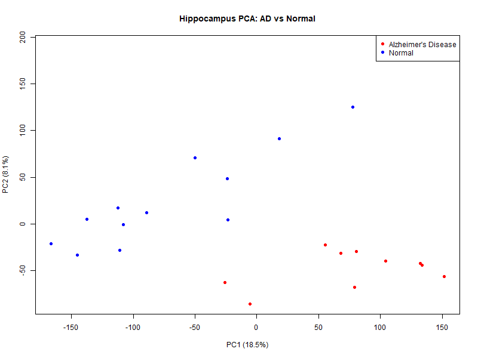

# Alzheimer Hippocampus Gene Expression
Self learning project analyzing gene expression differences between Alzheimer's and healthy hippocampus samples (GSE5281)

## A Note on This Project

I am a first year Statistics student at Hacettepe University. I did this project because I am interested in biostatistics, and I used an AI assistant (Claude) to help me while working on it.

## What This Project Does

This project looks at gene expression data from brain tissue and tries to answer a simple question: can we tell Alzheimer's Disease (AD) patients
apart from healthy people just by looking at which genes are more or less active? I used three basic methods to explore this: PCA (a way to simplify
a lot of data into a picture), a statistical test to find genes that differ between the two groups, and two simple machine learning models to try to
predict AD from gene activity.

## Data

I used the GSE5281 dataset from NCBI GEO (Gene Expression Omnibus), a public database for gene expression data.
The full dataset has 161 brain tissue samples (87 AD, 74 healthy) from six different brain regions. Since AD and healthy samples were not evenly 
spread across regions, using all of them together would risk mixing up brain region differences with disease differences. To avoid this, I
narrowed the analysis down to a single region: the hippocampus, which is one of the areas most affected by Alzheimer's Disease. This left 23
samples (10 AD, 13 healthy) a much smaller dataset, but a cleaner one.Each sample has expression values for 54,675 probes (a probe roughly corresponds to a gene, though a few genes are covered by more than one probe). This means the dataset has far more variables (54,675) than samples (23) — a common situation in gene expression data, and one that needs to be kept in mind when interpreting any result below.

## Preprocessing

I checked the data for missing values (there were none) and looked at the distribution of expression values. The raw values were highly skewed 
(median around 49, maximum around 144,000), so I applied a log2 transformation, which is standard practice for this type of data.
While exploring the data, I noticed that some of the top genes in my early results were labeled 'AFFX-....' These are not real human genes they are synthetic control probes added for quality control purposes.Their presence at the top of my results suggested a technical difference between samples rather than a biological one, so I removed all control probes before continuing.

## PCA Results

To see if AD and healthy samples look different from each other overall, I used PCA (Principal Component Analysis). PCA takes all 54,613 genes for
each sample and reduces them into just a few numbers, so we can plot each sample as a single point and see if patterns show up.

The first two components (PC1 and PC2) explain 18.5% and 8.1% of the variation in the data (26.6% together). This might sound low, but it is
normal for gene expression data, since there are far more genes (54,613) than samples (23).Looking at the plot, healthy samples (blue) are mostly on the left side and AD samples (red) are mostly on the right side, along PC1. The separation is not perfect a few points fall in the wrong area but the pattern is clear enough to suggest that gene expression differences between the two groups are real, not just random noise.
